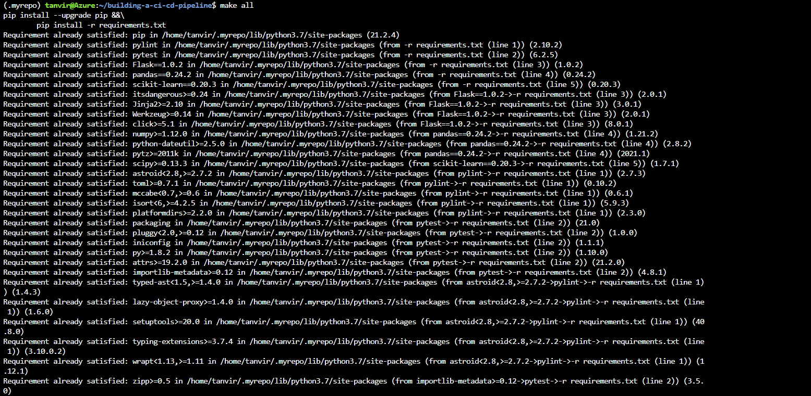
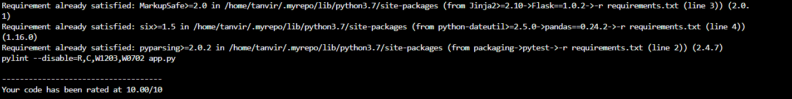

[](https://github.com/tanviriqbal/building-a-ci-cd-pipeline/actions)

# Introduction
This is my submission for the 'Building a CI/CD Pipeline' project as part of the 'Cloud DevOps using Microsoft Azure' nanodegree program from [Udacity](https://udacity.com).

In this project, we will build a Github repository from scratch and create a scaffolding that will assist you in performing both Continuous Integration and Continuous Delivery. We'll use Github Actions along with a ```Makefile```, ```requirements.txt``` and application code to perform an initial lint, test, and install cycle. Next, we'll integrate this project with Azure Pipelines to enable Continuous Delivery to Azure App Service.

This project contains a python application that is designed to predict housing prices in Boston (the app is not developed by me).

# Project Plan
This repo will enable you to:
- Deploy the app in Azure CloudShell 
- Deploy the app as an Azure App Service 

Any commits to the GitHub repo trigger automated code testing using GitHub Actions. A pipeline has been created in Azure DevOps, and the updated code is also automatically tested in Azure DevOps and deployed to the Azure App Service. 

Here is an architectural diagram:


A [Trello](https://trello.com/b/U1veFxKH/building-ci-cd-pipeline) board has been created to keep track of tasks to be completed.

A [spreadsheet](project-management.xlsx) has been created to manage the project schedule.

See [here](https://www.youtube.com/watch?v=g-IOL2b68g4&t=329s) for a YouTube video demonstrating the project.

# Instructions

## Deploy the app in Azure Cloud Shell
In Azure Cloud Shell, clone the repo:
```
git clone git@github.com:tanvirIqbal/building-a-ci-cd-pipeline.git
```
 

Change into the new directory:
```
cd building-a-ci-cd-pipeline
```

Create a virtual environment:
```
python3 -m venv ~/.myrepo
```

Activate the virtual environment:
```
source ~/.myrepo/bin/activate
```

Install dependencies in the virtual environment and run tests:
```
make all
```
 
 

Start the application in the local environment:
```
export FLASK_APP=app.py  
flask run  
```

Open a separate Cloud Shell and test that the app is working:
```
./make_prediction.sh
```

The output should match the below:


## Deploy the app to an Azure App Service

Create an App Service in Azure. In this example the App Service is called rob-udacity-webapp and the resource group is called rob-udacity-project:
```
az group create -l westus -n udacity  
az webapp up -n tanvir-udacity-webapp -g -udacity
```

Next, create the pipeline in Azure DevOps. More information on this process can be found [here](https://docs.microsoft.com/en-us/azure/devops/pipelines/ecosystems/python-webapp?view=azure-devops&WT.mc_id=udacity_learn-wwl). The basic steps to set up the pipeline are:

- Go to [https://dev.azure.com](https://dev.azure.com) and sign in.
- Create a new private project.
- Under Project Settings create a new service connection to Azure Resource Manager, scoped to your subscription and resource group.
- Create a new pipeline linked to your GitHub repo.

Screenshot of the App Service in Azure:


Screenshot of a successful run of the project in Azure Pipelines:


Screenshot of a successful build the project in GitHub Action:


To test the app running in Azure App Service, edit line 28 of the make_predict_azure_app.sh script with the DNS name of your app. Then run the script:
```
./make_predict_azure_app.sh 
```

If it's working you should see the following output:


You can also visit the [URL](https://tanvir-udacity-webapp.azurewebsites.net/) of the App Service via the browser.

View the app logs:
```
az webapp log tail -g udacity --name tanvir-udacity-webapp
```

## Load Test

We can use locust to do a load test against our application. In this example we will do a load test against the app running in azure rather than locally.

Install locust and then run locust:
```
pip install locust
locust
```


Open a browser and go to http://localhost:8089. Enter the total number of users to simulate, spawn rate, set the host to https://tanvir-udacity-webapp.azurewebsites.net/, and click Start Swarming:


# Future Enhancements
Currently, there is only a single branch in GitHub. In the future, the project can be configured to work with multiple branches, so if you commit to a particular branch, the code can continue to be deployed in the corresponding environment (Development, QA, Staging or production).
